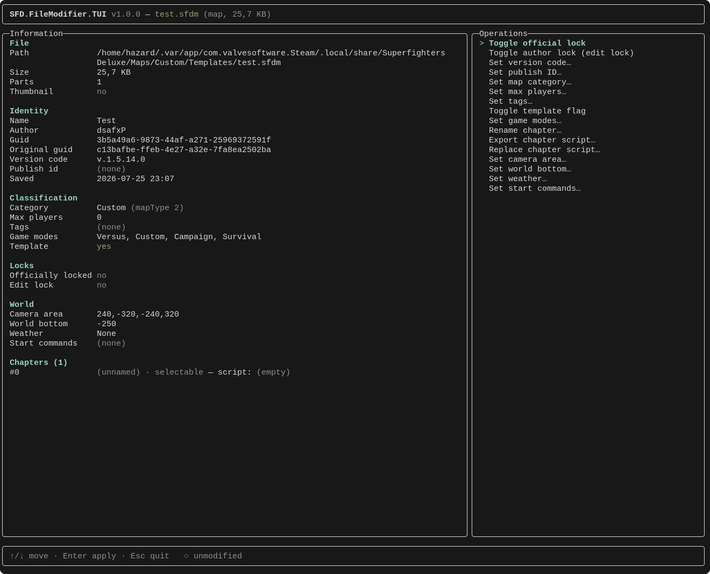

<div align="center">

[](https://store.steampowered.com/app/855860)

# Superfighters Deluxe File Modifier

.NET TUI tool to modify Superfighters Deluxe maps (.sfdm) and extension scripts (.sfde)

[](LICENSE)
[](https://github.com/MythoFame/SFD.FileModifier/releases)



</div>

Open any map (`.sfdm`) or extension script (`.sfde`) and edit it right from your terminal. 

The left side shows everything inside the file: name, author, category, locks, and more. The right side lists all available actions. 

Pick one, apply it, and save a new copy.

## ✨ Features

**For all files:**
- Toggle official lock / author edit lock
- Set version code and publish ID
- Set category (Versus, Custom, Campaign, Survival, Challenge)
- Set max players (1-16)
- Set tags (Adventure Map, Melee Map, Bot Support, etc.)
- Toggle template flag
- Set game modes

**For maps only:**
- Rename chapters
- Export or replace a chapter's embedded script (`.cs`)
- Set camera area, world bottom, weather (None / Snow / Rain), and start commands

**For extension scripts only:**
- Export or replace the embedded C# source (`.cs`)

## 🚀 Installation

Download a binary from [releases](https://github.com/MythoFame/SFD.FileModifier/releases) and execute it:

```sh
SFD.FileModifier.TUI myMap.sfdm
```

Append the `--help` argument to see available options
